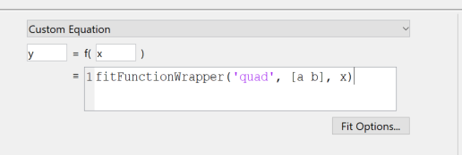

# How to Use

This repository provides functions useful for fitting various decays found in spectroscopy and other applications. `fitFunctions.m` generates anonymous functions commonly used for fitting--e.g. single, multiple, and stretched exponentials. For example

`fitFunctions('sing_exp_conv')`

returns an anonymous function describing a single exponential convoluted with a Gaussian. 

## Fitting in scripts

This can be used in fitting as follows: 

`fit_obj = fit(x,y, fittype(fitFunctions('sing_exp_conv')), ...)`

## Fitting in GUI

`fitFunctionWrapper.m` is used for fitting in the MATLAB `cftool` GUI. After selecting your data, select custom equation and call `fitFunctionWrapper.m` . For example: 

fits the data with the function `quad` which has two parameters which are called `a` and `b` here.

## Other details

The numerical convolutions are carried out by `gaussConv.m`. This function is called as follows:

`gaussConv(x,y,sig)`

and returns a vector corresponding to `y` convoluted with a Gaussian with standard deviation `sig`. 

The other files in the repository are used for testing. 